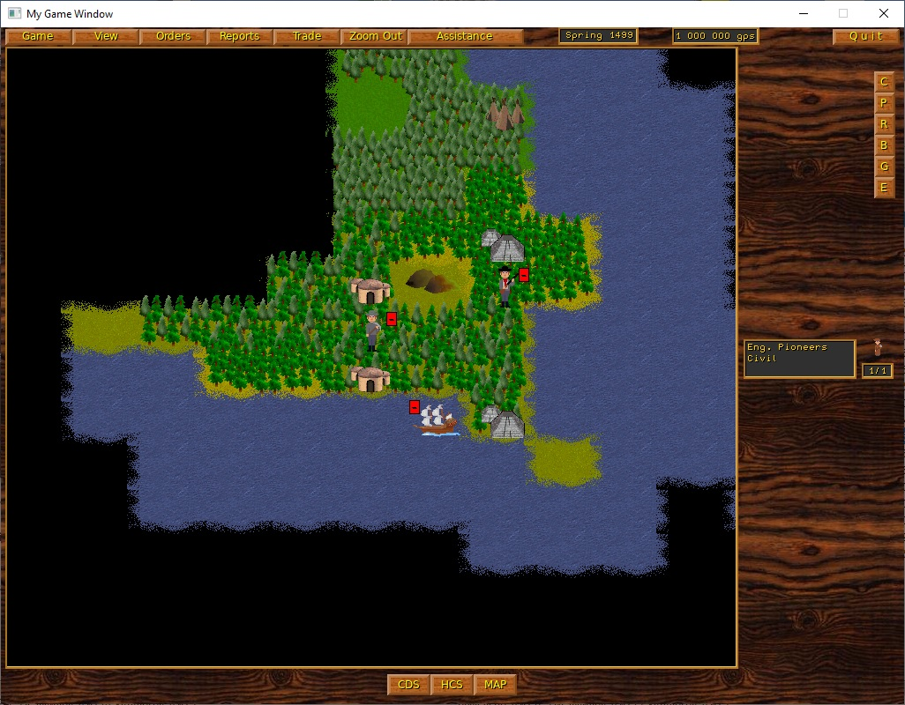
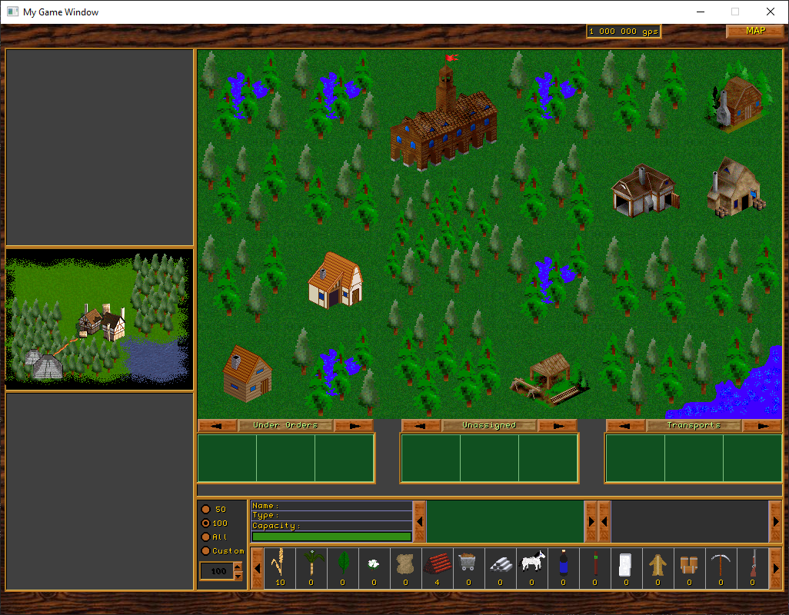

# New text
I ported this project to SDL2. A complete refactoring of the project is required. The game is compiled.
The project needs a complete refactoring.

# Recent changes
Added SDL2 support
Added Cmake support

# Original text
NOTE: this version is just a demo, indicating the development
progress. It only includes basic features.
For platform-specific information, see INSTALL.
For known bug list, see BUGS.
Links:

- project site: http://www.civgaming.net/col2
- forum: http://www.civgaming.net/forums/forumdisplay.php?f=14
- SourceForge project page: http://www.sf.net/projects/coltoo

Sikon <sikon@godorok.net>

  
 